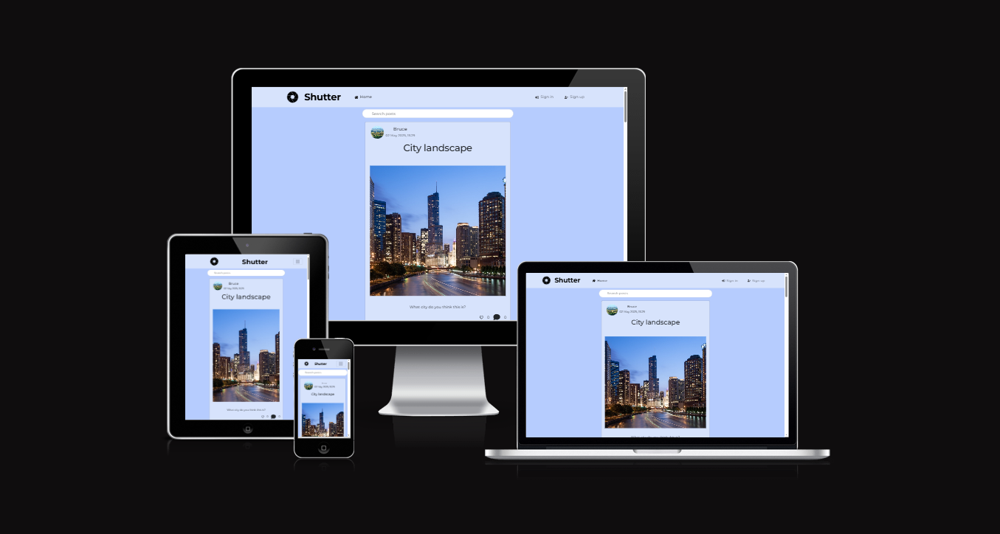
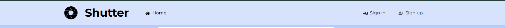
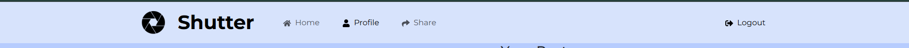
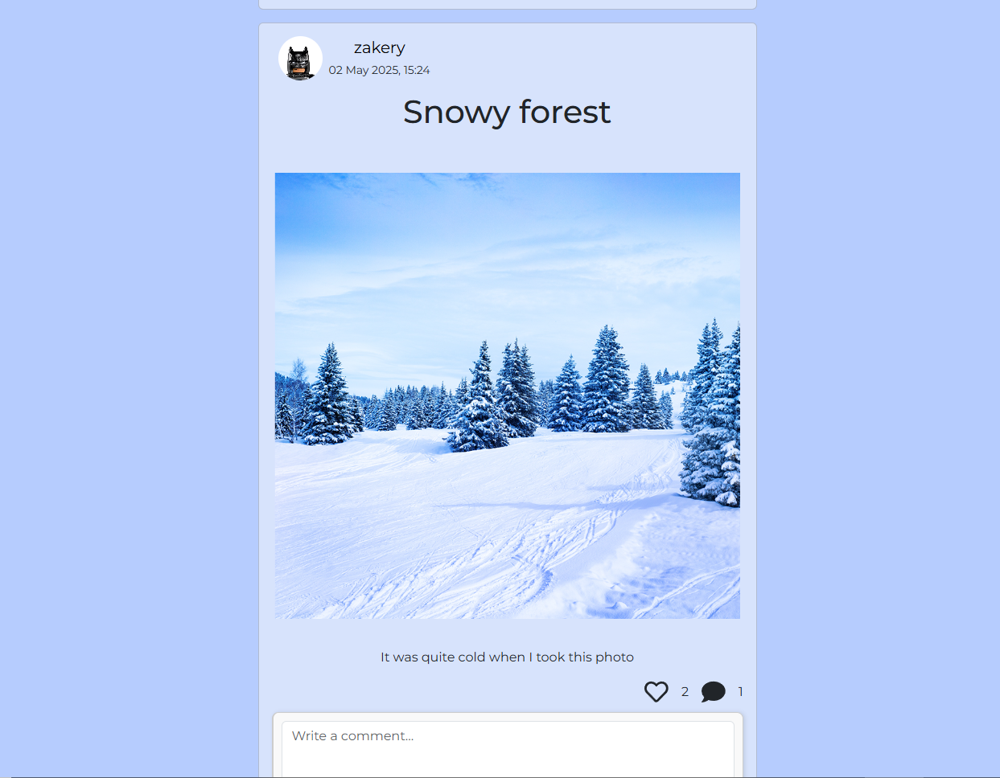
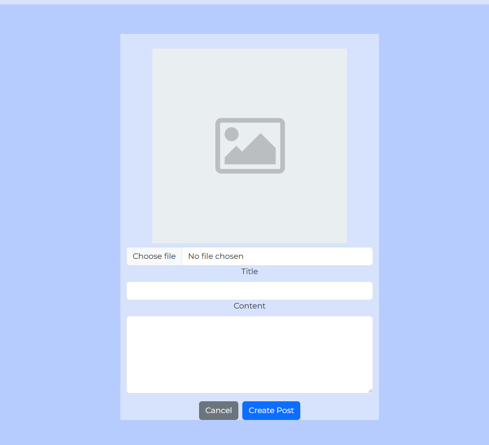
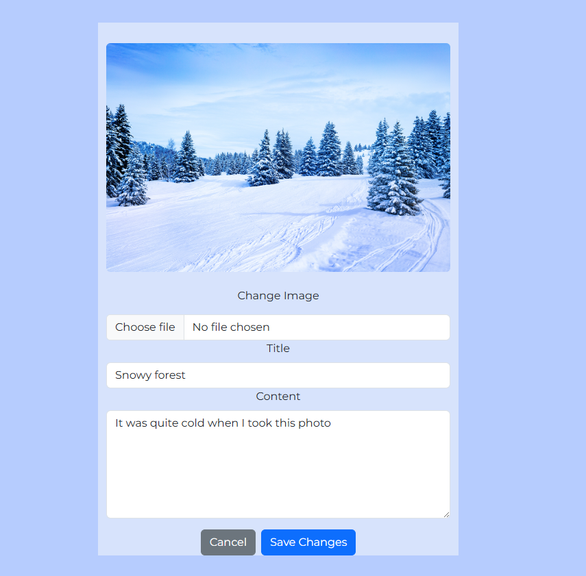
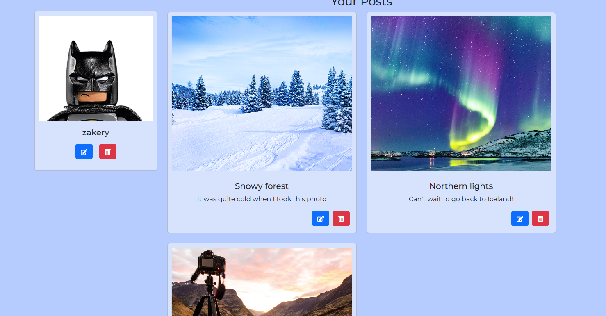
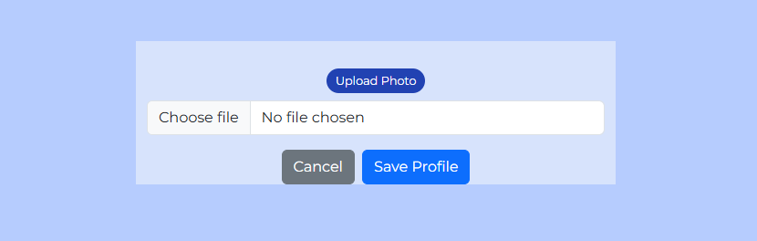
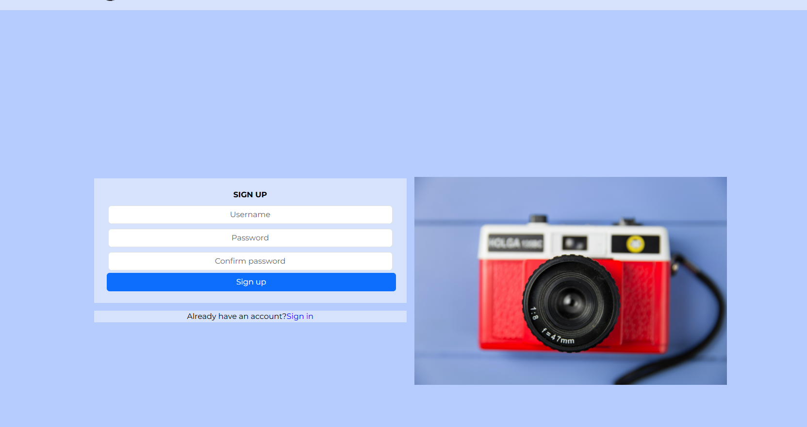

# Shutter

Shutter is a photography-focused social media web application that allows users to share visual content and engage with others through likes and comments. The platform encourages creativity and community by enabling users to create posts with images and captions, interact with others’ content, and manage their own personal profiles. 

Shutter is designed to be intuitive, fully responsive, and user-friendly—whether you're a casual viewer or an active contributor. The aim is to provide a clean, simple space for users to explore, express, and connect through shared visual experiences.

 
### Existing Features

- __Navigation Bar (loggedOut)__

  - When the user is not logged in, the navigation bar displays links to sign in, sign up and home page.
  - Navigation remains intuitive and consistent across all devices.

- __Navigation Bar (loggedIn)__

  - The navigation bar appears on all pages and includes links to the homepage, create post form, profile, and logout.
  - Fully responsive, with a collapsible menu on smaller screens.
  - Shows the user's avatar and name once logged in on the profiles page for a personalized experience.

- __Home Page__

  - Displays all public posts in reverse chronological order.
  - Each post shows an image, title, content preview, like count, and comment count.
  - Users can search posts by title.
  - Infinite scroll for seamless navigation.
  - Unauthenticated users are prompted to log in when attempting to like or comment.

- __Create Post Form__

  - Users can create new posts including a title, content, and image.
  - The image preview updates in real-time upon upload.
  - Form validates required fields and redirects to the homepage with updated content after submission.

- __Edit Post Form__

  - Users can update existing posts with new content or images.
  - Only the post owner can access the edit form.
  - Form pre-populates with existing post data for easy editing.

- __Profile Page__

  - Displays the logged-in user's profile info and their posts.
  - Allows editing or deleting user posts.
  - Profile image defaults to a generic avatar unless changed by the user.

- __Edit Profile Page__

  - Authenticated users can edit their name, bio, and profile picture.
  - Input validation ensures a smooth user experience.

- __Sign In__

  - The sign in page allows the user to login and be able to use the restricted features, liking, commenting and creating posts.

- __Sign Up__

  - This page allows the user to create an account so they can create posts, like, comment and delete all if needed.

## User Stories

- I didn't user a wireframe for this project because I based the design on the website from the moments project, I wanted
a light and simplistic feel so went with blue and used react icons.

- Link to me user stories - https://github.com/users/ZakL1/projects/5?query=sort%3Aupdated-desc+is%3Aopen

## Manual Testing 

-   __Manual Test 1: Creating a Post__
- Goal: Check that a logged-in user can successfully create a new post and see it on the homepage.

- Steps I Took:

- Logged into my test account.

- Clicked on “Create Post” in the navbar.

- Filled in the title, content, and uploaded an image.

- Clicked the “Create Post” button.

- What I Expected: The post would be created and take me back to the homepage where I’d see it listed.

- What Happened: Worked perfectly — the post appeared instantly on the homepage and on my profile.

- Result: Pass

-   __Manual Test 2: Liking a Post__
- Goal: Make sure logged-in users can like and unlike a post.

- Steps I Took:

- Logged in.

- Found a post on the homepage.

- Clicked the heart icon to like it.

- Clicked it again to unlike it.

- What I Expected: The like count would go up and down accordingly.

- What Happened: Everything worked as expected, and I couldn’t like my own posts — which is good!

- Result: Pass

-   __Manual Test 3: Posting a Comment__
- Goal: Test if a user can add a comment to a post and see it show up.

- Steps I Took:

- Logged in.

- Clicked the comment icon under a post.

- Typed a comment and hit submit.

- What I Expected: My comment would appear right away below the form.

- What Happened: The comment popped up immediately and stayed there after refreshing the page.

- Result: Pass

-   __Manual Test 4: Edit Profile__
- Goal: Check if I can update my profile bio and image.

- Steps I Took:

- Logged in and went to my profile page.

- Clicked “Edit Profile”.

- Uploaded a new profile picture.

- Clicked save and went back to my profile.

- What I Expected: The picture would update and be visible immediately.

- What Happened: The new info showed up straight away — no issues.

- Result: Pass

## Automatic testing

- Did not have time to implement this

### Validator Testing 

- CSS
  - No errors were found when passing through the official [(Jigsaw) validator](https://jigsaw.w3.org/css-validator/validator?uri=https%3A%2F%2Fvalidator.w3.org%2Fnu%2F%3Fdoc%3Dhttps%253A%252F%252Fcode-institute-org.github.io%252Flove-running-2.0%252Findex.html&profile=css3svg&usermedium=all&warning=1&vextwarning=&lang=en#css)
- Javascript
  - No errors were found when passing through the official [ESLint validator](https://eslint.org/play/)

### Unfixed Bugs

- Attempted fix but couldn't do it in time - when the user creats a post they are redirected to the postspage, however the user needs to
refresh the page to like and comment on posts

### Future features

- Add followers to profiles 
- Add functionality to edit comments inline
- The ability to go to other users accounts 
- Upload videos with audio
- Remember me button for quick and easy sign in

## Deployment

- The site was deployed to GitHub pages. The steps to deploy are as follows: 
  - In the GitHub repository, navigate to the Settings tab 
  - From the source section drop-down menu, select the Master Branch
  - Once the master branch has been selected, the page will be automatically refreshed with a detailed ribbon display to indicate the successful deployment. 

- The site was deployed to Heroku. The steps to deploy are as follows: 
  - In Heroku create app and link with github 
  - Add procfile to your repository
  - Install gunicorn to your repository
  - In codestar settings add herokuapp to allowed hosts
  - When in heroku go to deploy branch and click deploy main

The live link can be found here - https://shutter-main-990a60fdcc03.herokuapp.com/

## Credits 

### Content 

- ChatGPT was used for some of the content and debugging help
- The icons are react-icons
- The fonts were taken from [Google fonts](https://fonts.google.com/)
- The Moments project helped to give me an idea on the structure of my website
- A big thank you to the code intitute tutor team for the help!

### Media

- All images are from google images
